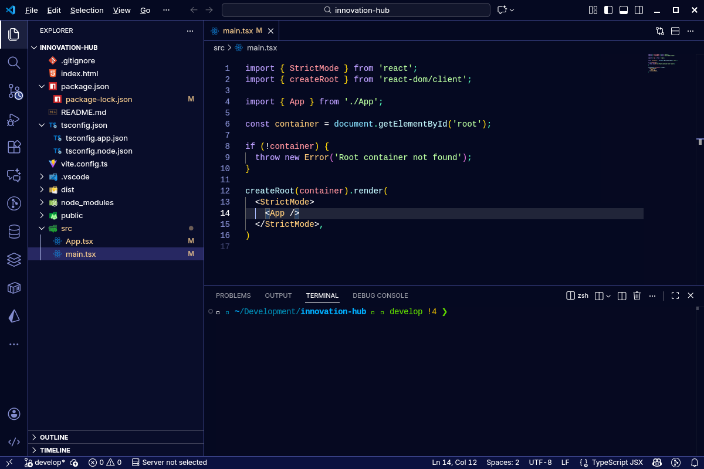

<h1 align="center">Já é cinco da manhã — Tema VS Code</h1>

Um tema escuro com acentos em ciano/azul e contraste confortável para longas sessões. Inspirado em madrugadas produtivas.

## Screenshots

## Instalação local (dev)
- Instale dependências (apenas para empacotar): `npm install -g @vscode/vsce`
- Gere o pacote: `vsce package`
- Instale o `.vsix` gerado: `code --install-extension ja-eh-cinco-da-manha-<versao>.vsix`

## Como testar em modo desenvolvimento
- Abra o projeto no VS Code: `code .`
- Pressione `F5` para abrir a janela Extension Development Host.
- Em `Preferences: Color Theme`, selecione **Já é cinco da manhã**.
- Ajuste o tema e recarregue a janela com `Developer: Reload Window` para ver mudanças.

## Publicação (resumo)
- Crie um publisher no Marketplace.
- `vsce login <publisher>` usando um PAT com escopos de Marketplace/Packaging.
- Ajuste a versão em `package.json` e publique: `vsce publish`.

## Nota de design
- Fundo escuro profundo (`#060921`), realces em ciano/verde suave e bordas em azul arroxeado para separar áreas sem poluição visual.
- Dropdowns e inputs usam tons sólidos e opacos para legibilidade nas telas de Configurações.
